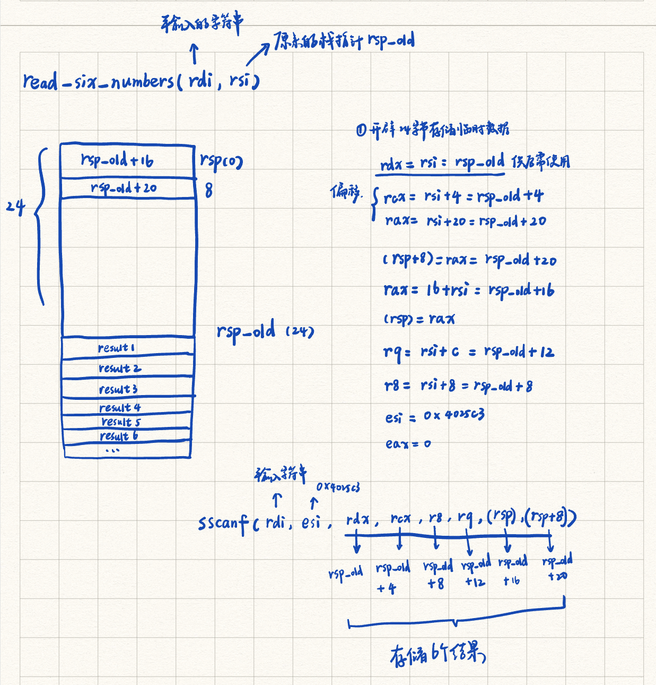
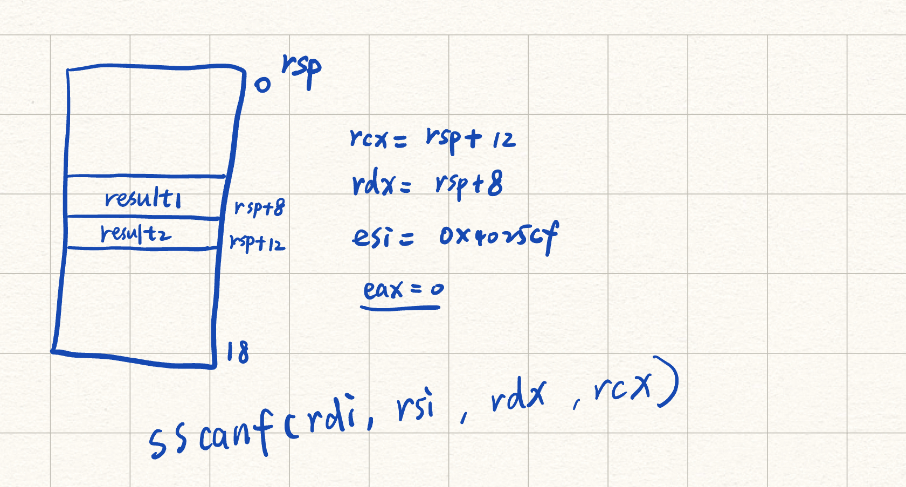

## bomb-lab

### 实验说明

本实验通过逆向的方式模拟拆炸弹的过程，炸弹共有6道锁，我们需要逐一破解每一道锁，最终拆除炸弹。我们可以通过执行./bomb开始输入密码，也可以把密码输入到任意文件中作为参数传递给./bomb，例如./bomb psol.txt

一些需要用到的工具：

- gdb（GNU调试器）

你可以逐行跟踪程序，检查内存和寄存器，查看源代码和汇编代码（我们不会给你炸弹的大部分源代码），设置断点、设置内存观察点，并编写脚本。

CMU提供了一个gdb快速参考页：[gdb参考文档](https://www.cs.cmu.edu/~gilpin/tutorial/)

gdb的一些小技巧：设置断点；设置断点可以防止程序因输入错误而爆炸。

在 gdb 命令提示符下输入 help，或在 Unix 提示符下输入 man gdb 或 info gdb 查看在线文档。

- objdump -t

这个工具可以打印出炸弹程序的符号表。

符号表包含了炸弹中所有函数和全局变量的名称、炸弹调用的所有函数的名称及其地址。

可以观察这个函数名称获得一些有用的信息。

- objdump -d

这个工具可以反汇编炸弹的所有代码，也可以选择只查看某些特定函数的代码。

阅读汇编代码可以帮助理解炸弹的工作原理。

- strings

这个工具会显示炸弹中所有可打印的字符串。

- man/info查看工具的用法

### 准备步骤

1.生成符号表

```
objdump -t bomb > ./symbol_table.txt
```

如下所示：

```
bomb:     file format elf64-x86-64


SYMBOL TABLE:
0000000000400238 l    d  .interp	0000000000000000              .interp
0000000000400254 l    d  .note.ABI-tag	0000000000000000              .note.ABI-tag
0000000000400274 l    d  .note.gnu.build-id	0000000000000000              .note.gnu.build-id
0000000000400298 l    d  .gnu.hash	0000000000000000              .gnu.hash
00000000004002c8 l    d  .dynsym	0000000000000000              .dynsym
00000000004005c8 l    d  .dynstr	0000000000000000              .dynstr
```

使用如下命令：

```
man objdump
```

可以查看每一列的含义：

第一列是地址；第二列是标志位，这里列出几种常见的：l代表本地，g代表全局，f代表文件，F代表函数，O代表对象；第三列是符号所属的段名称，或者是ABS，表示该段是绝对的，与任何段无关。或者是UND，表示没有定义在当前程序中；第四段是对齐方式/大小。最后会显示符号的名称。

2.生成所有汇编代码

```
objdump -d bomb > ./bomb.s
```

### 开始分析

#### 第一个密码

查看bomb.c文件，有如下代码：

```
    /* Do all sorts of secret stuff that makes the bomb harder to defuse. */
    initialize_bomb();

    printf("Welcome to my fiendish little bomb. You have 6 phases with\n");
    printf("which to blow yourself up. Have a nice day!\n");

    /* Hmm...  Six phases must be more secure than one phase! */
    input = read_line();             /* Get input                   */
    phase_1(input);                  /* Run the phase               */
    phase_defused();                 /* Drat!  They figured it out!
				      * Let me know how they did it. */
    printf("Phase 1 defused. How about the next one?\n");
```

可以看到phase_1函数判断input是否正确，查看bomb.s中phase_1的汇编代码：

```
0000000000400ee0 <phase_1>:
  400ee0:	48 83 ec 08          	sub    $0x8,%rsp
  400ee4:	be 00 24 40 00       	mov    $0x402400,%esi // esi是第二个参数
  400ee9:	e8 4a 04 00 00       	callq  401338 <strings_not_equal>
  400eee:	85 c0                	test   %eax,%eax
  400ef0:	74 05                	je     400ef7 <phase_1+0x17> // 如果返回值为0，正常退出
  400ef2:	e8 43 05 00 00       	callq  40143a <explode_bomb> // 返回值不为0，炸弹爆炸
  400ef7:	48 83 c4 08          	add    $0x8,%rsp
  400efb:	c3                   	retq   
```

可以看到，phase_1实际上是调用了strings_not_equal判断两个输入参数是否相等，是则解决，反之爆炸。可以写出phase_1的伪代码：

```
phase_1(rdi) {
  esi = 0x402400;
  eax = strings_not_equal(rdi, esi);
  if (!eax) {
    explode_bomb();
  }
}
```

查看bomb.s中main函数，定位到调用phase_1之前，查看rdi的内容：

```
  400e19:	e8 84 05 00 00       	callq  4013a2 <initialize_bomb>
  400e1e:	bf 38 23 40 00       	mov    $0x402338,%edi
  400e23:	e8 e8 fc ff ff       	callq  400b10 <puts@plt>
  400e28:	bf 78 23 40 00       	mov    $0x402378,%edi
  400e2d:	e8 de fc ff ff       	callq  400b10 <puts@plt>
  400e32:	e8 67 06 00 00       	callq  40149e <read_line>
  400e37:	48 89 c7             	mov    %rax,%rdi // %rax是read_line的返回值，也就是输入的字符串,作为参数传递给phase_1
  400e3a:	e8 a1 00 00 00       	callq  400ee0 <phase_1>
```

可知，rdi就是我们输入的字符串。大胆猜测strings_not_equal这里就是在判断我们的输入与0x402400处的字符串是否相等。查看strings_not_equal汇编代码求证，其写成伪代码逻辑为：

```
strings_not_equals(rdi, rsi){
	//第一个字符串
	rbx = rdi;
	//第二个字符串
	rbp = rsi;
	eax = string_length(rdi);
	//r12d 存长度
	r12d = eax;
	rdi = rbp;
	eax = string_length(rdi);
  if(eax != r12d) retrun eax = edx = 1;
	eax = *(rbx);
	for(al != 0){
		if(al != *(rbp)) retrun eax = edx = 1;
		rbx++;
		rbp++;
		eax = *(rbx);
	}
	return eax = edx = 0;
}
```

就是一个判断两个字符串是否相等的函数，所以第一个密码就是0x402400处的字符串。可以通过gdb输出：

```
(gdb) x/s 0x402400
0x402400:       "Border relations with Canada have never been better."
```

x: 表示执行“检查内存”的命令;/s: 指定检查内存的格式为字符串 (string);0x402338: 指定要检查的内存地址。

#### 第二个密码

定位到phase_2调用的汇编代码：

```
  400e4e:	e8 4b 06 00 00       	callq  40149e <read_line>
  400e53:	48 89 c7             	mov    %rax,%rdi // 同样字符串输入作为参数rdi
  400e56:	e8 a1 00 00 00       	callq  400efc <phase_2> 
  400e5b:	e8 64 07 00 00       	callq  4015c4 <phase_defused>
```

查看phase_2的汇编代码：

```
0000000000400efc <phase_2>:
  400efc:	55                   	push   %rbp
  400efd:	53                   	push   %rbx
  400efe:	48 83 ec 28          	sub    $0x28,%rsp // 开辟栈操作
  400f02:	48 89 e6             	mov    %rsp,%rsi // 此时的rsp栈指针作为第二个参数rsi传递给read_six_numbers
  400f05:	e8 52 05 00 00       	callq  40145c <read_six_numbers> // 将输入的字符串解析为6个整型数据依次存储在栈上
  400f0a:	83 3c 24 01          	cmpl   $0x1,(%rsp) // 比较(%rsp)与0x1
  400f0e:	74 20                	je     400f30 <phase_2+0x34> // 相等则跳转到400f30，即第一个数据是1
  400f10:	e8 25 05 00 00       	callq  40143a <explode_bomb> // 不相等炸弹爆炸
  400f15:	eb 19                	jmp    400f30 <phase_2+0x34>
  400f17:	8b 43 fc             	mov    -0x4(%rbx),%eax // eax = (rbx - 4) = (rsp)，即第一个数据
  400f1a:	01 c0                	add    %eax,%eax // eax = eax + eax = 2 * (rsp)，即是第一个数据的两倍
  400f1c:	39 03                	cmp    %eax,(%rbx) // 比较第二个数据与第一个数据的两倍是否相等
  400f1e:	74 05                	je     400f25 <phase_2+0x29> // 相等跳转400f25
  400f20:	e8 15 05 00 00       	callq  40143a <explode_bomb> // 不相等爆炸
  400f25:	48 83 c3 04          	add    $0x4,%rbx // rbx = 4 + rbx = rsp + 8，即下一个数据的地址
  400f29:	48 39 eb             	cmp    %rbp,%rbx // 比较是否到达最后一个数据
  400f2c:	75 e9                	jne    400f17 <phase_2+0x1b> // 不到达，跳转400f17继续循环，每一次比较下一个数据是否是上一个数据的两倍
  400f2e:	eb 0c                	jmp    400f3c <phase_2+0x40> // 到达退出循环
  400f30:	48 8d 5c 24 04       	lea    0x4(%rsp),%rbx // rbx = 4 + rsp，即是第二个数据的地址
  400f35:	48 8d 6c 24 18       	lea    0x18(%rsp),%rbp // rbp = 24 + rsp，即最后一个数据的地址
  400f3a:	eb db                	jmp    400f17 <phase_2+0x1b> // 跳转到400f17
  400f3c:	48 83 c4 28          	add    $0x28,%rsp // 销毁栈操作
  400f40:	5b                   	pop    %rbx
  400f41:	5d                   	pop    %rbp
  400f42:	c3                   	retq   
```

可知，phase_2调用read_six_numbers，rdi、rsi作为两个输入参数，查看其汇编代码：

```
000000000040145c <read_six_numbers>:
  40145c:	48 83 ec 18          	sub    $0x18,%rsp
  401460:	48 89 f2             	mov    %rsi,%rdx
  401463:	48 8d 4e 04          	lea    0x4(%rsi),%rcx
  401467:	48 8d 46 14          	lea    0x14(%rsi),%rax
  40146b:	48 89 44 24 08       	mov    %rax,0x8(%rsp)
  401470:	48 8d 46 10          	lea    0x10(%rsi),%rax
  401474:	48 89 04 24          	mov    %rax,(%rsp)
  401478:	4c 8d 4e 0c          	lea    0xc(%rsi),%r9
  40147c:	4c 8d 46 08          	lea    0x8(%rsi),%r8
  401480:	be c3 25 40 00       	mov    $0x4025c3,%esi
  401485:	b8 00 00 00 00       	mov    $0x0,%eax
  40148a:	e8 61 f7 ff ff       	callq  400bf0 <__isoc99_sscanf@plt>
  40148f:	83 f8 05             	cmp    $0x5,%eax
  401492:	7f 05                	jg     401499 <read_six_numbers+0x3d>
  401494:	e8 a1 ff ff ff       	callq  40143a <explode_bomb>
  401499:	48 83 c4 18          	add    $0x18,%rsp
  40149d:	c3                   	retq   
```

可知，在40148a处，调用了sscanf函数，sscanf函数的原型如下：

```
int sscanf(const char *str, const char *format, ...);
```

第一个str表示输入字符串的地址，sscanf 会从这个字符串中解析数据。第二个format是格式化字符串，定义如何解析输入数据，例如："%d %d"。后面的...表示可变参数，是一个或多个指针，用于存储解析出的数据。每个指针对应 format 中的一个格式说明符。

实际上，这个考察了当参数数量超过可用寄存器数量（6个，分别是rdi、rsi、rdx、rcx、r8、r9），超出6个的部分就必须要通过栈来传递。read_six_numbers中的汇编代码大部分都是在初始化这些参数，包括初始化寄存器和栈上需要传递的值。由地址401480可知，0x4025c3作为第二个参数format，通过gdb可以查看该参数的值：

```
(gdb) x/s 0x4025c3
0x4025c3:       "%d %d %d %d %d %d"
```

可知，这里需要解析6个int整型数据。所以我们知道这里实际上在为sscanf准备8个参数（str、format和6个存储整型数据的指针），可见下面的分析图：



上面的分析可知，解析出来的6个整型数被依次存储在phase_2的栈中，于是继续回到上面的phase_2的汇编代码分析，分析可知，phase_2在判断第一个数据是否为1且后面每个数据是否是前一个数据的两倍，可以写出下面的伪代码：

```
phase_2(rdi) {
	rsi = rsp;
	read_six_numbers(rdi, rsi); // 解析6个整型数据
	if (rsp[0] != 1) {
		explode_bomb();
	}

	for (int i = 1; i < 6; i++) {
		if (rsp[i] != 2 * rsp[i - 1]) {
			explode_bomb();
		}
	}
}
```

由上面的分析可知，第二个密码是：

```
1 2 4 8 16 32
```

#### 第三个密码

直接跳转到phase_3的汇编代码：

```
0000000000400f43 <phase_3>:
  400f43:	48 83 ec 18          	sub    $0x18,%rsp
  400f47:	48 8d 4c 24 0c       	lea    0xc(%rsp),%rcx // rcx = rsp + 12，第四个参数，存储result2
  400f4c:	48 8d 54 24 08       	lea    0x8(%rsp),%rdx // rdx = rsp + 8，第三个参数，存储result1
  400f51:	be cf 25 40 00       	mov    $0x4025cf,%esi
  400f56:	b8 00 00 00 00       	mov    $0x0,%eax
  400f5b:	e8 90 fc ff ff       	callq  400bf0 <__isoc99_sscanf@plt>
  400f60:	83 f8 01             	cmp    $0x1,%eax // eax是成功解析数量
  400f63:	7f 05                	jg     400f6a <phase_3+0x27> // 解析字段大于1，跳转400f6a
  400f65:	e8 d0 04 00 00       	callq  40143a <explode_bomb>
  400f6a:	83 7c 24 08 07       	cmpl   $0x7,0x8(%rsp) // 比较result1和7，result1 - 7判断
  400f6f:	77 3c                	ja     400fad <phase_3+0x6a> // result1 > 7，跳转400fad，炸弹爆炸，也就是result1必须小于等于7（注意，ja是无符号判断）
  400f71:	8b 44 24 08          	mov    0x8(%rsp),%eax // eax = (rsp + 8) = result1
  400f75:	ff 24 c5 70 24 40 00 	jmpq   *0x402470(,%rax,8) // 跳转到0x402470 + 8 * result1，跳转到0x402470 + 8 * result1（这里实际上是一个跳转表，根据result1的取值不同，有8种可能：0到7）
  400f7c:	b8 cf 00 00 00       	mov    $0xcf,%eax
  400f81:	eb 3b                	jmp    400fbe <phase_3+0x7b>
  400f83:	b8 c3 02 00 00       	mov    $0x2c3,%eax // result1 = 2的跳转表位置，eax = 707
  400f88:	eb 34                	jmp    400fbe <phase_3+0x7b>
  400f8a:	b8 00 01 00 00       	mov    $0x100,%eax
  400f8f:	eb 2d                	jmp    400fbe <phase_3+0x7b>
  400f91:	b8 85 01 00 00       	mov    $0x185,%eax
  400f96:	eb 26                	jmp    400fbe <phase_3+0x7b>
  400f98:	b8 ce 00 00 00       	mov    $0xce,%eax
  400f9d:	eb 1f                	jmp    400fbe <phase_3+0x7b>
  400f9f:	b8 aa 02 00 00       	mov    $0x2aa,%eax
  400fa4:	eb 18                	jmp    400fbe <phase_3+0x7b>
  400fa6:	b8 47 01 00 00       	mov    $0x147,%eax
  400fab:	eb 11                	jmp    400fbe <phase_3+0x7b>
  400fad:	e8 88 04 00 00       	callq  40143a <explode_bomb>
  400fb2:	b8 00 00 00 00       	mov    $0x0,%eax
  400fb7:	eb 05                	jmp    400fbe <phase_3+0x7b>
  400fb9:	b8 37 01 00 00       	mov    $0x137,%eax
  400fbe:	3b 44 24 0c          	cmp    0xc(%rsp),%eax
  400fc2:	74 05                	je     400fc9 <phase_3+0x86> // 判断result2是否与跳转分支的相等
  400fc4:	e8 71 04 00 00       	callq  40143a <explode_bomb>
  400fc9:	48 83 c4 18          	add    $0x18,%rsp
  400fcd:	c3                   	retq  
```

可知，类似的调用sscanf解析输入字符串，解析格式format在0x4025cf，用gdb查看：

```
(gdb) x/s 0x4025cf
0x4025cf:       "%d %d"
```

可知，解析为两个int整型数据result1和result2，结果存放在rsp+8和rsp+12处。如下图所示：




继续分析，result1必须小于等于7，根据result1的值，result2有一个跳转表可以取不同的值（这里是一个switch结构）。由于有8种可能,查看0x402470起始的跳转表的8个不同分支：

```
(gdb) x/8gx 0x402470
0x402470:       0x0000000000400f7c      0x0000000000400fb9
0x402480:       0x0000000000400f83      0x0000000000400f8a
0x402490:       0x0000000000400f91      0x0000000000400f98
0x4024a0:       0x0000000000400f9f      0x0000000000400fa6
```

跳转表按8字节对齐，x 是 GDB 的查看内存命令。/8gx 表示显示 4 个 64 位（8 字节）地址，按十六进制格式输出。上面代表8个不同的跳转地址。

可以写出下列伪代码：

```
phase_3(rdi) {
	rcx = rsp + 12;
	rdx = rsp + 8;
	esi = 0x4025cf;
	eax = sscanf(rdi, esi, rdx, rcx);
	if (eax <= 1) {
		explode_bomb(); // 解析字段数不超过1
	}

	if ((rsp + 8) > 7) {
		explode_bomb();  // result1超过7
	}

	eax = (rsp + 8);
	switch ((rax)) {
		case 0:
			...
			(省略，只保留case 2)
		case 2:
			eax = 0x2c3;
			break;
		
	}
	if ((rsp + 12) != eax) {
		explode_bomb(); // 如果result2与case中的结果不相等
	}
}
```

这里选择result1 = 2,对应跳转分支为0x0000000000400f83，得出result2为：707。密码如下：

```
2 707
```

#### 第四个密码

直接跳转到phase_4,类似的sscanf接收format为"%d %d"，解析两个结果保存在rsp+8和rsp+12。具体过程不再分析。

```
000000000040100c <phase_4>:
  40100c:	48 83 ec 18          	sub    $0x18,%rsp
  401010:	48 8d 4c 24 0c       	lea    0xc(%rsp),%rcx
  401015:	48 8d 54 24 08       	lea    0x8(%rsp),%rdx
  40101a:	be cf 25 40 00       	mov    $0x4025cf,%esi
  40101f:	b8 00 00 00 00       	mov    $0x0,%eax
  401024:	e8 c7 fb ff ff       	callq  400bf0 <__isoc99_sscanf@plt>
  401029:	83 f8 02             	cmp    $0x2,%eax
  40102c:	75 07                	jne    401035 <phase_4+0x29>
  40102e:	83 7c 24 08 0e       	cmpl   $0xe,0x8(%rsp)
  401033:	76 05                	jbe    40103a <phase_4+0x2e>
  401035:	e8 00 04 00 00       	callq  40143a <explode_bomb>
  40103a:	ba 0e 00 00 00       	mov    $0xe,%edx
  40103f:	be 00 00 00 00       	mov    $0x0,%esi
  401044:	8b 7c 24 08          	mov    0x8(%rsp),%edi
  401048:	e8 81 ff ff ff       	callq  400fce <func4>
  40104d:	85 c0                	test   %eax,%eax
  40104f:	75 07                	jne    401058 <phase_4+0x4c>
  401051:	83 7c 24 0c 00       	cmpl   $0x0,0xc(%rsp)
  401056:	74 05                	je     40105d <phase_4+0x51>
  401058:	e8 dd 03 00 00       	callq  40143a <explode_bomb>
  40105d:	48 83 c4 18          	add    $0x18,%rsp
  401061:	c3                   	retq
```
